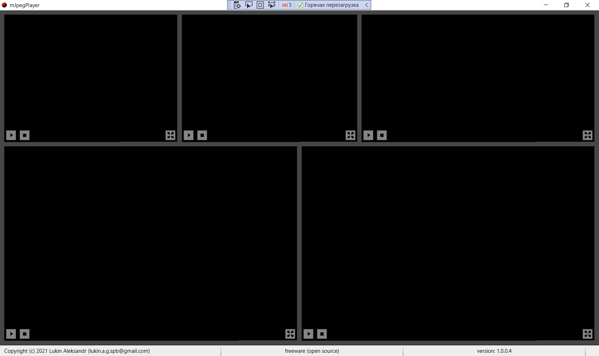

mJpegPlayer v.1.0.4
by Aleksandr Lukin (lukin.a.g.spb@gmail.com)

The program is designed to view video streams from multiple IP cameras in mjpeg format.

The program is configured through the configuration.xml file in the root of the program. 

As a video server (stream source for mJpegPlayer), for example, you can use "Motion Project" https://github.com/Motion-Project/motion

to decode stream (in) the library is used: 

MJPEG Decoder v1.2.1
by Brian Peek (http://www.brianpeek.com/)

Screenshots:

